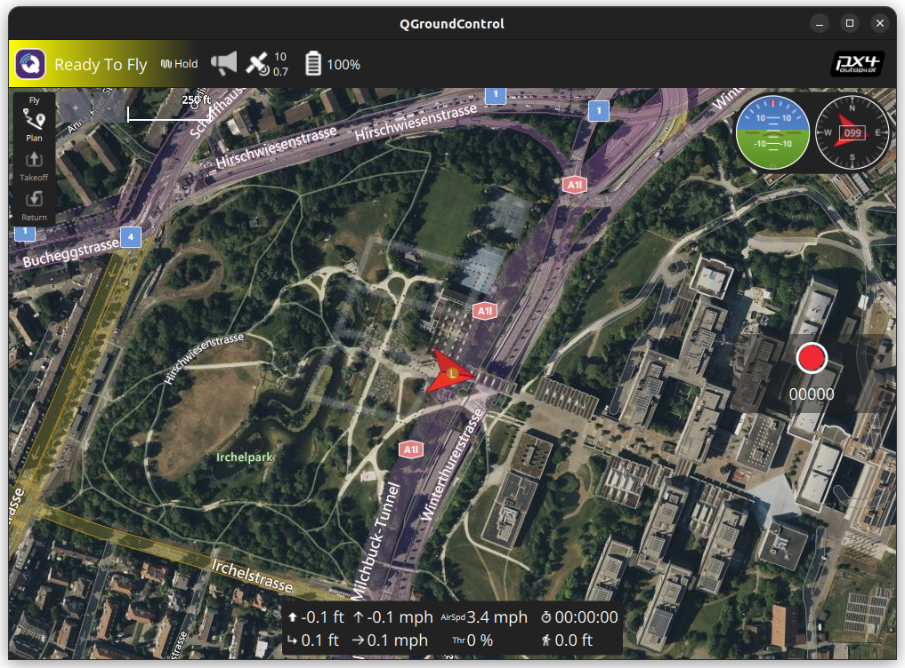
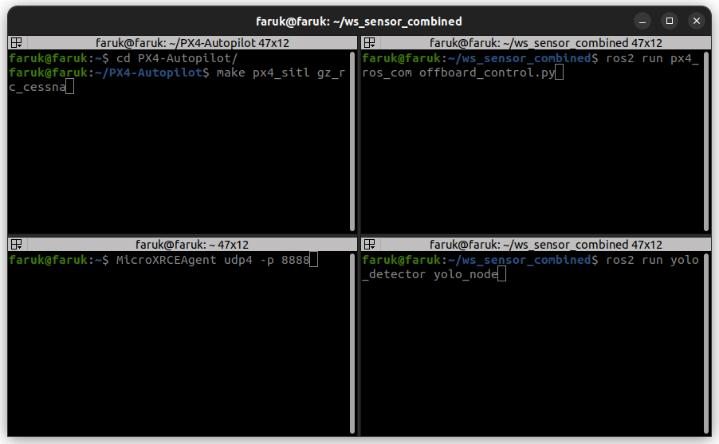

# Terminalde çalıştırılacak kodlar


## Terminal 1: 
Ana dizinde PX4-Autopilot yüklü olması gerekiyor. Yüklü değilse ilk olarak aşağıdaki kod satırını çalıştırın. [PX4-Autopilot](https://docs.px4.io/main/en/ros2/user_guide.html).
```sh
cd
git clone https://github.com/PX4/PX4-Autopilot.git --recursive
bash ./PX4-Autopilot/Tools/setup/ubuntu.sh
cd PX4-Autopilot/
make px4_sitl
```
Eğer PX4-Autopilot yüklü ise direkt olarak aşağıdaki kodları çalıştırabilirsiniz. Gazebo'da fixed-wing bir iha açılması lazım.
  ```sh
cd PX4-Autopilot/
make px4_sitl gz_rc_cessna
  ```
 #
 QGroundControl programını çalıştırıp "arm" edilmesi gerekiyor.
 
 
 
 #
## Terminal 2:
Haberleşmeyi sağlayan modülü çalıştırın.
  ```sh
  MicroXRCEAgent udp4 -p 8888
  ```
## Terminal 3:
ROS2 workspace içerisine girip offboard control node'unu çalıştırın.
  ```sh
cd ~/ws_taygun
colcon build
source install/setup.bash
ros2 run px4_ros_com offboard_control.py
  ```
## Terminal 4:
ROS2 workspace içerisine girip yolo detector node'unu çalıştırın.
  ```sh
cd ~/ws_taygun
colcon build
source install/setup.bash
ros2 run yolo_detector yolo_node
  ```




